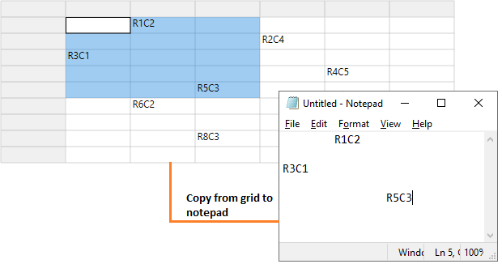

# How to Copy Selected Text from WPF GridControl to Clipboard (notepad or any other external sources)?

This repository contains the samples which demonstrates various clipboard operation customization in [WPF GridControl](https://www.syncfusion.com/wpf-controls/excel-like-grid).

`GridControl` provides support for clipboard operations. You can cut or copy and paste data to or from grid to other external sources, like notepad, excel, etc.

You can change the copy paste operations in `GridControl` by setting the flaggable enum [CopyPasteOption](https://help.syncfusion.com/cr/wpf/Syncfusion.Windows.Controls.Grid.GridModelOptions.html#Syncfusion_Windows_Controls_Grid_GridModelOptions_CopyPasteOption) property. You can enable copy and paste by setting `CopyPasteOption` property to [CopyText](https://help.syncfusion.com/cr/wpf/Syncfusion.Windows.Controls.Grid.CopyPaste.html) and [PasteText](https://help.syncfusion.com/cr/wpf/Syncfusion.Windows.Controls.Grid.CopyPaste.html).

``` csharp
gridControl.Model.Options.ActivateCurrentCellBehavior = GridCellActivateAction.DblClickOnCell;
grid.Model.Options.CopyPasteOption = CopyPaste.CopyText | CopyPaste.PasteText;
```

